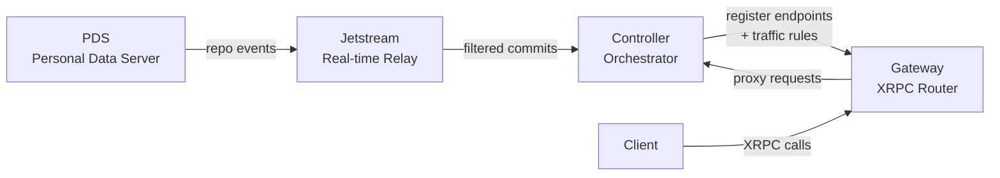

# AVaaSt — App View as a Service for AT Protocol

Publish declarative queries, functions, search indexes, and subscriptions as AT Protocol records.
AVaaSt deploys them as live XRPC endpoints.

## What is AVaaSt?

AT Protocol separates data hosting (PDS) from application logic (App Views). AVaaSt lets you define
your App View entirely through AT Protocol records — no server code required.

You write a **computed query** as a JSON record, publish it to your PDS, reference it in a **deploy**
record, then activate it with an **appView** record. AVaaSt watches your PDS for these records,
resolves the dependency graph, and stands up live XRPC endpoints that clients can query immediately.

The same pattern works for serverless **functions** (TypeScript executed in a Deno sandbox),
**search indexes** (full-text search backed by SQLite FTS5), and real-time **subscriptions**
(Server-Sent Events filtered from collection changes).

## Architecture



**PDS** stores your lexicon records. **Jetstream** relays repo commits in real time.
The **Controller** watches for `app.avaast.*` records, builds deploy manifests, executes
queries, and runs sandboxed functions. The **Gateway** routes incoming XRPC requests to the
correct deploy version using weighted traffic rules and sticky sessions.

## Monorepo Structure

| Package | Path | Description |
|---------|------|-------------|
| **@avaast/shared** | `packages/shared` | Types, Query DSL definitions, config schema, logger, retry utility |
| **@avaast/controller** | `packages/controller` | Watcher, deploy orchestrator, query engine, function executor |
| **@avaast/gateway** | `packages/gateway` | XRPC router, traffic shaper, admin API |
| **@avaast/cli** | `packages/cli` | CLI tool — `avaast start`, `avaast status`, `avaast validate` |

## Prerequisites

- **Node.js** 20+
- **pnpm** 9+
- **Docker** and **Docker Compose** (for the local PDS and Jetstream)

## Quick Start

```bash
# 1. Clone and install
git clone git@github.com:chris-pardy/AVaaSt.git && cd AVaaSt
pnpm install

# 2. Start local AT Protocol infrastructure
cp .env.example .env
docker compose up -d pds jetstream

# 3. Build all packages
pnpm build

# 4. Start AVaaSt (after setting AVAAS_WATCH_DID in .env)
pnpm --filter @avaast/cli start
```

The gateway listens on **port 3000** and the controller on **port 3001** by default.

## Configuration

AVaaSt reads configuration from a JSON file (`avaast.json`), environment variables, or both.
Environment variables override file values.

### Environment Variables

| Variable | Required | Default | Description |
|----------|----------|---------|-------------|
| `AVAAS_WATCH_DID` | Yes | — | DID of the account whose `app.avaast.*` records to watch |
| `AVAAS_PDS_ENDPOINT` | No | auto-resolved | PDS endpoint URL (resolved from DID if omitted) |
| `AVAAS_WATCH_RKEY` | No | `self` | Record key for the appView record |
| `AVAAS_PORT` | No | `3000` | Gateway HTTP port |
| `AVAAS_CONTROLLER_PORT` | No | `3001` | Controller HTTP port |
| `AVAAS_HOSTNAME` | No | — | Custom hostname for the app view |
| `AVAAS_MAX_PROCESSES` | No | `4` | Max concurrent function sandbox processes (1–32) |
| `AVAAS_FUNCTION_TIMEOUT` | No | `30000` | Function execution timeout in ms (100–30000) |
| `AVAAS_FUNCTION_MEMORY` | No | `128` | Function memory limit in MB (64–1024) |

### Local PDS Variables (for Docker Compose dev setup)

| Variable | Default | Description |
|----------|---------|-------------|
| `PDS_HOSTNAME` | `localhost` | PDS hostname |
| `PDS_JWT_SECRET` | `devjwtsecret-unsafe-do-not-use-in-prod` | JWT signing secret |
| `PDS_ADMIN_PASSWORD` | `admin` | PDS admin password |

## Docker Compose Services

| Service | Port | Description |
|---------|------|-------------|
| **pds** | 2583 | Local AT Protocol Personal Data Server (`ghcr.io/bluesky-social/pds:0.4`) |
| **jetstream** | 6008, 6009 | Real-time AT Protocol event relay |
| **controller** | 3001 | AVaaSt controller — watches PDS, orchestrates deploys, executes queries |
| **gateway** | 3000 | AVaaSt gateway — XRPC routing, traffic shaping, admin API |
| **deno-runtime** | — | Deno sandbox for user-defined function execution |

## Core Concepts

### Record Types

AVaaSt is driven by six record types published to your PDS:

| Record | Collection | Purpose |
|--------|-----------|---------|
| **Computed** | `app.avaast.computed` | Declarative query over AT Protocol collections |
| **Function** | `app.avaast.function` | TypeScript/JS code executed in a Deno sandbox |
| **Search Index** | `app.avaast.searchIndex` | Full-text search index over collection fields |
| **Subscription** | `app.avaast.subscription` | Real-time filtered event stream from collections |
| **Deploy** | `app.avaast.deploy` | Versioned bundle mapping endpoint names → resource refs |
| **App View** | `app.avaast.appView` | Live service definition with traffic routing rules |

### Deploy Lifecycle

A deploy progresses through these states:

```
PENDING → FETCHING → RESOLVING → BUILDING → ACTIVATING → ACTIVE
                                                            ↓
                                                         DRAINING → RETIRED
```

Any state can transition to `FAILED` on error. When a new deploy becomes `ACTIVE`, older
active deploys automatically begin `DRAINING`.

### Traffic Shaping

The `appView` record contains **traffic rules** — an array of `{ deploy, weight }` pairs where
weights are in **basis points** (0–10000, must sum to 10000).

```json
{
  "trafficRules": [
    { "deploy": { "did": "did:plc:abc", "cid": "bafyv1" }, "weight": 9000 },
    { "deploy": { "did": "did:plc:abc", "cid": "bafyv2" }, "weight": 1000 }
  ]
}
```

This sends 90% of traffic to deploy v1 and 10% to v2 — useful for canary releases.
Authenticated users get **sticky sessions** (DID-based deterministic routing) so the same
user always hits the same deploy version.

## The AVaaSt Query DSL

Computed records contain a declarative **Query** object — a SQL-like AST with sources, joins,
filters, aggregations, and ordering. The query engine executes it against live PDS data.

### Expression Types

| Type | Description | Example |
|------|-------------|---------|
| `fieldRef` | Reference a field from a source | `{ source: "posts", field: "text" }` |
| `literal` | Constant value | `{ stringValue: "hello" }` |
| `comparison` | Binary comparison | `eq`, `neq`, `gt`, `lt`, `like`, `in`, `between`, ... |
| `logicalOp` | Boolean logic | `and`, `or`, `not` |
| `arithmeticOp` | Math | `add`, `subtract`, `multiply`, `divide`, `modulo` |
| `builtinCall` | Built-in function | `count`, `sum`, `avg`, `lower`, `coalesce`, `now`, ... |
| `functionCall` | Call a user-defined function | References a `app.avaast.function` resource |
| `caseExpression` | Conditional branching | `CASE WHEN ... THEN ... ELSE ... END` |

### Built-in Functions

**Aggregates:** `count`, `sum`, `avg`, `min`, `max`
**String:** `concat`, `lower`, `upper`, `trim`, `length`, `substring`
**Math:** `abs`, `round`, `floor`, `ceil`
**Utility:** `coalesce`, `now`

### Query Structure

```
SELECT  →  select: [{ alias, value: Expression }]
FROM    →  from: { alias, collection, did? }
JOIN    →  joins: [{ joinType, source, on: Expression }]
WHERE   →  where: Expression
GROUP BY → groupBy: [Expression]
HAVING  →  having: Expression
ORDER BY → orderBy: [{ value: Expression, direction }]
LIMIT   →  limit / offset
DISTINCT → distinct: true
```

## Example: Pirate App

The included `chat.pirate.*` lexicons demonstrate AVaaSt end-to-end. The pirate app has two
collections: **avast** (shout messages) and **aye** (reactions to shouts).

### Step 1 — Define a computed query

This query joins avasts with their aye counts, ordered newest-first:

```json
{
  "name": "chat.pirate.getAvasts",
  "query": {
    "select": [
      { "alias": "uri",       "value": { "type": "fieldRef", "source": "avast", "field": "_uri" } },
      { "alias": "text",      "value": { "type": "fieldRef", "source": "avast", "field": "text" } },
      { "alias": "createdAt", "value": { "type": "fieldRef", "source": "avast", "field": "createdAt" } },
      { "alias": "ayeCount",  "value": { "type": "builtinCall", "name": "count",
                                          "args": [{ "type": "fieldRef", "source": "aye", "field": "_uri" }] } }
    ],
    "from": { "alias": "avast", "collection": "chat.pirate.avast" },
    "joins": [{
      "joinType": "left",
      "source": { "alias": "aye", "collection": "chat.pirate.aye" },
      "on": { "type": "comparison", "op": "eq",
              "left":  { "type": "fieldRef", "source": "aye",   "field": "avast.uri" },
              "right": { "type": "fieldRef", "source": "avast", "field": "_uri" } }
    }],
    "groupBy": [{ "type": "fieldRef", "source": "avast", "field": "_uri" }],
    "orderBy": [{ "value": { "type": "fieldRef", "source": "avast", "field": "createdAt" }, "direction": "desc" }]
  },
  "outputSchema": [
    { "name": "uri",       "schema": { "type": "string" } },
    { "name": "text",      "schema": { "type": "string" } },
    { "name": "createdAt", "schema": { "type": "datetime" } },
    { "name": "ayeCount",  "schema": { "type": "integer" } }
  ],
  "createdAt": "2025-01-01T00:00:00.000Z"
}
```

Publish this to `app.avaast.computed` on your PDS.

### Step 2 — Create a deploy

```json
{
  "endpoints": [{
    "name": "chat.pirate.getAvasts",
    "kind": "computed",
    "ref": { "did": "<your-did>", "cid": "<computed-record-cid>" }
  }],
  "createdAt": "2025-01-01T00:00:00.000Z"
}
```

Publish to `app.avaast.deploy`.

### Step 3 — Activate with an appView

```json
{
  "name": "pirate-app",
  "trafficRules": [{
    "deploy": { "did": "<your-did>", "cid": "<deploy-record-cid>" },
    "weight": 10000
  }],
  "status": "active",
  "createdAt": "2025-01-01T00:00:00.000Z",
  "updatedAt": "2025-01-01T00:00:00.000Z"
}
```

Publish to `app.avaast.appView`.

### Step 4 — Query the endpoint

```bash
curl http://localhost:3000/xrpc/chat.pirate.getAvasts
```

Returns avasts ordered by `createdAt` descending with `ayeCount` for each.

## Lexicons

AVaaSt defines its own lexicons under the `app.avaast.*` namespace:

| Lexicon | File | Description |
|---------|------|-------------|
| `app.avaast.defs` | `lexicons/dev/avaas/defs.json` | Shared type definitions (expressions, queries, schemas) |
| `app.avaast.computed` | `lexicons/dev/avaas/computed.json` | Computed view records |
| `app.avaast.function` | `lexicons/dev/avaas/function.json` | Serverless function records |
| `app.avaast.searchIndex` | `lexicons/dev/avaas/searchIndex.json` | Search index definitions |
| `app.avaast.subscription` | `lexicons/dev/avaas/subscription.json` | Subscription definitions |
| `app.avaast.deploy` | `lexicons/dev/avaas/deploy.json` | Deploy bundles |
| `app.avaast.appView` | `lexicons/dev/avaas/appView.json` | App view service records |

App-specific lexicons (like `chat.pirate.avast` and `chat.pirate.aye`) live alongside
the AVaaSt lexicons in the `lexicons/` directory.

## Running Tests

The E2E test suite requires Docker services running:

```bash
# Start infrastructure
docker compose up -d pds jetstream

# Run tests
pnpm --filter @avaast/controller test
```

The pirate app E2E test creates a local PDS account, publishes computed/deploy/appView
records, populates test data, and queries the live endpoint through the gateway.

## Development

```bash
# Build all packages (respects project references)
pnpm build

# Type-check without emitting
pnpm typecheck

# Watch mode (per package)
pnpm --filter @avaast/controller dev
pnpm --filter @avaast/gateway dev

# Clean all build artifacts
pnpm clean
```
