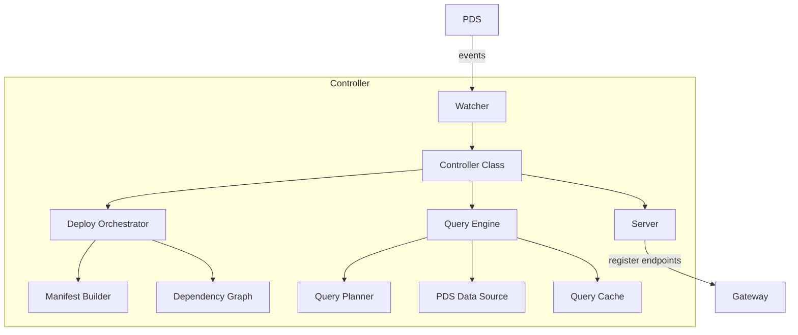

# @avaast/controller

Core orchestration engine for AVaaSt — watches PDS records, manages deployments, and executes queries.

## Purpose

The controller is the brain of AVaaSt. It watches a PDS for `app.avaast.*` record changes
(via Jetstream, firehose, or polling), resolves deploy dependency graphs, manages the deploy
lifecycle state machine, executes declarative queries against live PDS data, runs sandboxed
functions in Deno, and exposes an internal API consumed by the gateway.

## Architecture



## Controller Class

The `Controller` class wires everything together:

```typescript
import { Controller } from '@avaast/controller';

const controller = new Controller({
  pdsEndpoint: 'http://localhost:2583',
  watchDid: 'did:plc:abc123',
  jetstreamUrl: 'ws://localhost:6008/subscribe',  // optional
  controllerPort: 3001,
  gatewayUrl: 'http://localhost:3000',
});

await controller.start();  // starts server, then watcher
await controller.stop();   // stops watcher, then server
```

### Options

| Option | Required | Default | Description |
|--------|----------|---------|-------------|
| `pdsEndpoint` | Yes | — | PDS URL to connect to |
| `watchDid` | Yes | — | DID to watch for `app.avaast.*` records |
| `jetstreamUrl` | No | — | Jetstream WebSocket URL (enables real-time mode) |
| `controllerPort` | No | `3001` | HTTP server port |
| `gatewayUrl` | No | — | Gateway URL for endpoint/traffic registration |
| `dbPath` | No | `:memory:` | SQLite path for cursor persistence |
| `extraCollections` | No | `[]` | Additional collections for Jetstream to watch |

### Event Handling

The controller listens for changes to these collections:

| Collection | Handler |
|-----------|---------|
| `app.avaast.computed` | Stores record in memory by CID for query execution |
| `app.avaast.deploy` | Triggers `processDeploy()` → orchestrator lifecycle |
| `app.avaast.appView` | Extracts deploy refs, registers endpoints + traffic rules on gateway |

## Watcher Modes

The watcher uses a fallback strategy to observe PDS changes:

```
Jetstream (preferred) → Firehose (fallback) → Polling (final fallback)
```

### Jetstream

- **Protocol:** WebSocket to Jetstream relay
- **Format:** JSON messages with commit operations
- **Features:** Filtered by `wantedCollections`, auto-reconnect with exponential backoff (1s–30s)
- **Use when:** Jetstream relay is available (recommended for production)

### Firehose

- **Protocol:** WebSocket to `com.atproto.sync.subscribeRepos` on PDS
- **Format:** CBOR-encoded repo events
- **Features:** Cursor persistence in SQLite for resumption across restarts
- **Use when:** Direct PDS connection available but no Jetstream relay

### Polling

- **Protocol:** HTTP polling via `com.atproto.repo.listRecords`
- **Interval:** 30 seconds (configurable)
- **Detection:** CID comparison between polls to detect creates, updates, and deletes
- **Use when:** WebSocket connections unavailable

### Watched Collections

```
app.avaast.computed
app.avaast.function
app.avaast.searchIndex
app.avaast.subscription
app.avaast.deploy
app.avaast.appView
```

## Query Engine

The query engine executes declarative `Query` objects against live PDS data using a
multi-stage pipeline.

### Pipeline

```
Query AST
  → QueryPlanner.plan()  — produces a QueryPlan with PipelineSteps
  → executePlan()
      1. Fetch     — load records from PDS sources
      2. Join      — inner, left, right, cross joins
      3. Filter    — evaluate WHERE expression
      4. Group     — GROUP BY with aggregate tracking
      5. Having    — filter groups
      6. Select    — project fields and evaluate expressions
      7. Distinct  — deduplicate rows
      8. OrderBy   — sort by expression + direction
      9. Limit     — apply offset and limit
  → Return results
```

### Expression Evaluation

The engine evaluates the full `Expression` type hierarchy:

- **FieldRef** — resolves `source.field` from the current row (or `$params.name` for query parameters)
- **Literal** — returns the constant value
- **Comparison** — `eq`, `neq`, `gt`, `gte`, `lt`, `lte`, `like` (with `%` wildcards), `in`, `notIn`, `isNull`, `isNotNull`, `between`
- **LogicalOp** — short-circuit `and`/`or`, `not`
- **ArithmeticOp** — `add`, `subtract`, `multiply`, `divide`, `modulo`
- **BuiltinCall** — aggregates (`count`, `sum`, `avg`, `min`, `max`), string functions (`concat`, `lower`, `upper`, `trim`, `length`, `substring`), math (`abs`, `round`, `floor`, `ceil`), utility (`coalesce`, `now`)
- **CaseExpression** — evaluates branches in order, returns first match or else value

### Caching

Query results are cached with:
- **TTL-based expiration** (per computed record `cacheTtl`)
- **Version-aware invalidation** (cache busted when deploy version changes)
- **LRU eviction** at 10,000 entries (evicts oldest 10%)

## Deploy Orchestrator

Manages the full deploy lifecycle from record creation to retirement.

### State Machine

```
PENDING → FETCHING → RESOLVING → BUILDING → ACTIVATING → ACTIVE
                                                            │
                                                         DRAINING → RETIRED

Any state → FAILED (on error)
```

### Process

1. **PENDING** — Deploy record received from watcher
2. **FETCHING** — Preparing to download referenced resources
3. **RESOLVING** — ManifestBuilder resolves dependency graph via BFS traversal
4. **BUILDING** — Build `DeployManifest` with all resolved resources and code blobs
5. **ACTIVATING** — Manifest ready, endpoints being registered
6. **ACTIVE** — Deploy is live and serving traffic
7. **DRAINING** — Older deploy being phased out (triggered when a newer deploy activates)
8. **RETIRED** — Fully decommissioned

### Dependency Graph

The manifest builder uses BFS to discover transitive dependencies from deploy endpoints,
validates the graph (detecting circular dependencies), and resolves resources in topological
order.

## Internal API

The controller exposes these HTTP endpoints (consumed by the gateway):

### POST /internal/query

Execute a computed query.

```json
// Request
{ "deployRef": { "did": "...", "cid": "..." }, "endpointName": "chat.pirate.getAvasts", "params": {} }

// Response
{ "results": [...], "cached": false, "durationMs": 42 }
```

### POST /internal/function

Execute a sandboxed function. *(501 — not yet implemented)*

### POST /internal/search

Execute a search query. *(501 — not yet implemented)*

### POST /internal/subscribe

Open a subscription stream. *(501 — not yet implemented)*

### GET /internal/deploy/status

List all deploy statuses.

```json
{ "deploys": [{ "ref": {...}, "state": "ACTIVE", "activatedAt": "..." }] }
```

### GET /internal/health

Health check.

```json
{ "status": "ok" }
```

## Function Executor

User-defined functions run in isolated **Deno sandboxes** with:

- Restricted permissions: `--deny-env`, `--deny-sys`, `--deny-ffi`, `--deny-run`, `--deny-write`
- Network access limited to PDS hosts
- Configurable timeout (100–30000ms, default 30s)
- Configurable memory limit (64–1024MB, default 128MB)
- Process pool for concurrent execution (1–32 processes)

Functions receive **dependency handles** for accessing other AVaaSt resources:

| Handle | Methods |
|--------|---------|
| `ComputedHandle` | `query(params?)` |
| `FunctionHandle` | `call(input)` |
| `SearchHandle` | `search(params)` |
| `SubscriptionHandle` | `publish(event)` |
| `CollectionHandle` | `list()`, `get(rkey)`, `put()`, `delete()` (write mode only) |

## E2E Testing

The pirate app E2E test validates the full stack end-to-end.

### Prerequisites

```bash
docker compose up -d pds jetstream
```

### What the Test Does

1. Creates a test account on the local PDS
2. Starts controller (watching the test account) and gateway
3. Publishes a `app.avaast.computed` record with a LEFT JOIN + GROUP BY query
4. Publishes a `app.avaast.deploy` record referencing the computed endpoint
5. Publishes a `app.avaast.appView` record with 100% traffic to that deploy
6. Waits for the deploy to reach `ACTIVE` state
7. Creates pirate chat data: 3 avasts and 4 ayes (reactions)
8. Queries `GET /xrpc/chat.pirate.getAvasts` through the gateway
9. Asserts: 3 results, ordered by `createdAt` DESC, with correct aye counts (0, 1, 3)

### Running

```bash
pnpm --filter @avaast/controller test
```
