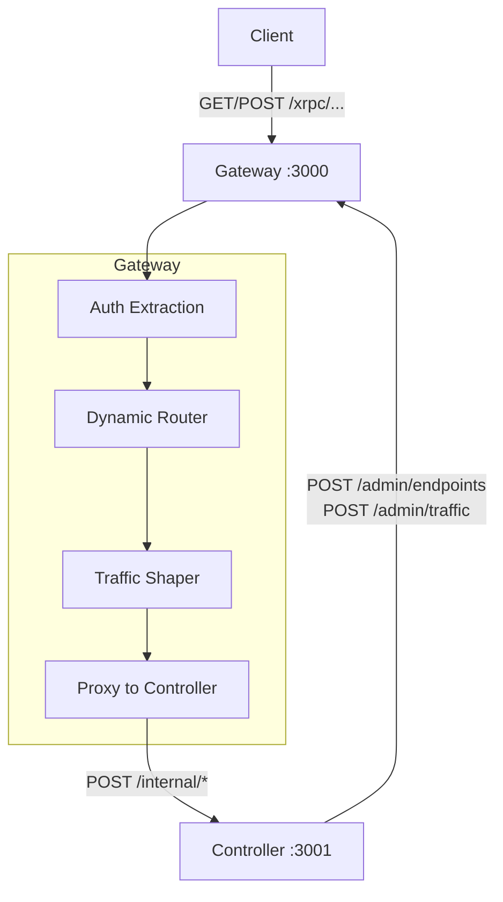

# @avaast/gateway

XRPC request router and traffic shaper for AVaaSt.

## Purpose

The gateway is the public-facing HTTP server that clients call. It receives XRPC requests,
extracts authentication, selects a deploy version via weighted traffic rules, and proxies the
request to the controller for execution. The gateway is stateless — all endpoint registrations
and traffic rules are pushed to it by the controller via the admin API.

## Architecture



## Request Flow

1. Client sends `GET` or `POST` to `/xrpc/{methodName}`
2. Gateway extracts auth context from `Authorization: Bearer <JWT>` header
3. Dynamic router looks up the endpoint by method name
4. Traffic shaper selects a deploy version (weighted random or sticky by DID)
5. Request is proxied to the controller's internal API based on endpoint kind
6. Response is returned to the client

## XRPC Routing

Each endpoint has a **kind** that determines the HTTP method and proxy target:

| Kind | Client Method | Controller Route | Response |
|------|--------------|-----------------|----------|
| `computed` | `GET /xrpc/{name}` | `POST /internal/query` | JSON results array |
| `function` | `POST /xrpc/{name}` | `POST /internal/function` | JSON output object |
| `searchIndex` | `GET /xrpc/{name}` | `POST /internal/search` | JSON results + facets + totalCount |
| `subscription` | `GET /xrpc/{name}` | `POST /internal/subscribe` | Server-Sent Events stream |

### Subscription SSE Format

```
event: connected
data: {"subscriberId":"abc123"}

event: notification
data: {"field":"value"}
id: 1706000000000
```

## Admin API

The controller pushes configuration to the gateway via these endpoints:

### POST /admin/endpoints

Register or update available XRPC endpoints.

```json
{
  "endpoints": [
    { "name": "chat.pirate.getAvasts", "kind": "computed", "ref": { "did": "...", "cid": "..." } }
  ]
}
```

**Response:** `{ "ok": true, "count": 1 }`

### POST /admin/traffic

Set weighted traffic routing rules. Weights are in basis points and must sum to 10000.

```json
{
  "rules": [
    { "deploy": { "did": "...", "cid": "bafyV1" }, "weight": 9000 },
    { "deploy": { "did": "...", "cid": "bafyV2" }, "weight": 1000 }
  ]
}
```

**Response:** `{ "ok": true, "count": 2 }`

### GET /admin/status

Returns gateway health and operational state.

```json
{
  "uptime": 120000,
  "registeredEndpoints": ["chat.pirate.getAvasts"],
  "trafficRules": [...]
}
```

## Traffic Shaping

Traffic rules use **basis points** (0–10000 = 0–100%) for precise weight distribution.

### Selection Algorithm

1. Rules are sorted by weight descending and accumulated into ranges
2. A random value in `[0, 10000)` is generated
3. The first rule whose cumulative range covers the value is selected

### Sticky Sessions

When a request includes a valid JWT with a DID (`iss` or `sub` claim), the DID is used as
a **sticky key**. A deterministic hash (DJB2) maps the DID to a fixed point in the
`[0, 10000)` range, ensuring the same user always routes to the same deploy version.

Unauthenticated requests use random selection.

**Example:** With rules `[{ weight: 7000 }, { weight: 3000 }]`:
- 70% of random traffic goes to deploy A
- `did:plc:alice` always hashes to the same deploy (sticky)

## Authentication

The gateway extracts auth context from JWT bearer tokens without verifying signatures
(signature verification is the controller's responsibility). It extracts the DID from the
`iss` or `sub` claim for sticky session routing.

```typescript
interface AuthContext {
  did?: string;
  authenticated: boolean;
}
```

## Configuration

```typescript
interface GatewayConfig {
  port: number;           // HTTP server port (default: 3000)
  controllerUrl: string;  // Controller base URL (e.g., "http://localhost:3001")
  hostname?: string;      // Optional bind hostname
}
```

## Exported API

```typescript
import { Gateway } from '@avaast/gateway';
import type { GatewayConfig, AuthContext } from '@avaast/gateway';
import { TrafficShaper, DynamicRouter, extractAuth } from '@avaast/gateway';
```
